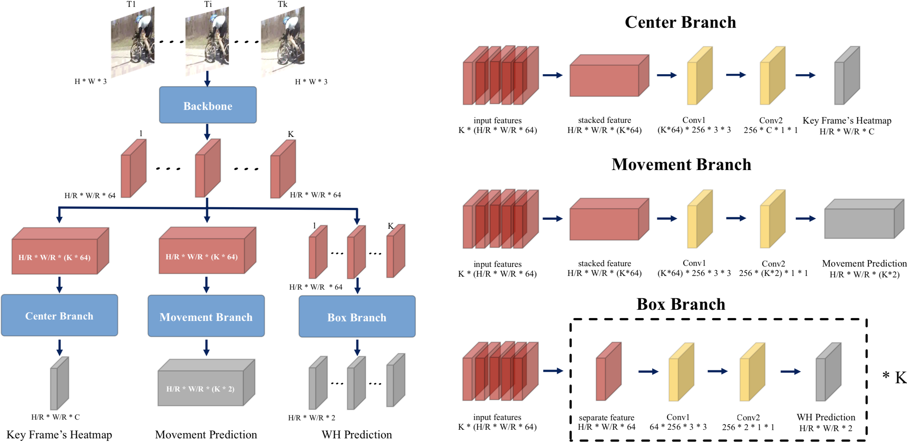
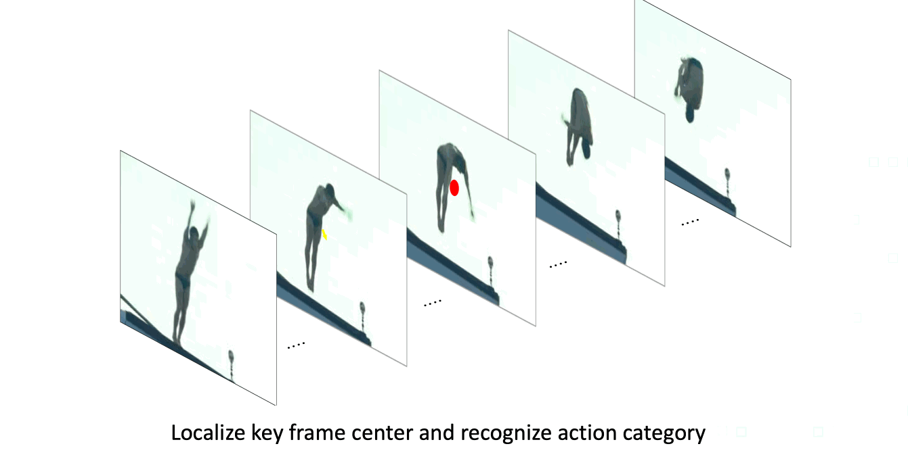

# Actions as Moving Points

> Pytorch implementation of [Actions as Moving Points](https://arxiv.org/abs/2001.04608) (ECCV 2020).
>
>  View each action instance as a trajectory of moving points.

 Visualization results on validation set. *(GIFs will take a few minutes to load......)*

<div align="center" style="width:image width px;">
  
  
  
</div>
<div align="center" style="width:image width px;">
  
  
  
</div>


*(Note that the relative low scores are due to the property of the focal loss.)*

<br/>

<br/>

## News & Updates

Jul. 08, 2020 - First release of codes.

Jul. 24, 2020 - Update ucf-pretrained JHMDB model and speed test codes.

<br/>

## MOC Detector Overview  

&emsp; We present a new action tubelet detection framework, termed as **MovingCenter Detector (MOC-detector)**, by treating an action instance as a trajectory of moving points. MOC-detector is decomposed into three crucial head branches:

- (1) **Center Branch** for instance center detection and action recognition.
- (2) **Movement Branch** for movement estimation at adjacent frames to form moving point trajectories.
- (3) **Box Branch** for spatial extent detection by directly regressing bounding box size at the estimated center point of each frame.

<div align="center" style="width:image width px;">
  
  
</div>

<br/>

<br/>

## MOC-Detector Usage

### 1. Installation

Please refer to [Installation.md](readme/Installation.md) for installation instructions.

### 2. Dataset

Please refer to [Dataset.md](readme/Dataset.md) for dataset setup instructions.

### 3. Evaluation

After [Installation.md](readme/Installation.md) and [Dataset.md](readme/Dataset.md), you can follow the instructions in [Evaluation.md](readme/Evaluation.md) to evaluate our model and reproduce the results in original paper.

### 4. Train

After [Installation.md](readme/Installation.md) and [Dataset.md](readme/Dataset.md), you can follow the instructions in [Train.md](readme/Train.md) to reproduce our experiments.

<br/>

<br/>

## References

- Data augmentation codes from [ACT](https://github.com/vkalogeiton/caffe/tree/act-detector).

- Evaluation codes from [ACT](https://github.com/vkalogeiton/caffe/tree/act-detector).

- DLA-34 backbone codes from [CenterNet](https://github.com/xingyizhou/CenterNet).

  [ACT LICENSE](https://github.com/vkalogeiton/caffe/blob/act-detector/LICENSE)

  [CenterNet LICENSE](https://github.com/xingyizhou/CenterNet/blob/master/LICENSE)

  See more in [NOTICE](NOTICE)

  <br/>

  <br/>


### Citation
If you find this code is useful in your research, please cite:

```bibtex
@InProceedings{li2020actions,
    title={Actions as Moving Points},
    author={Yixuan Li and Zixu Wang and Limin Wang and Gangshan Wu},
    booktitle={arXiv preprint arXiv:2001.04608},
    year={2020}
}
```
