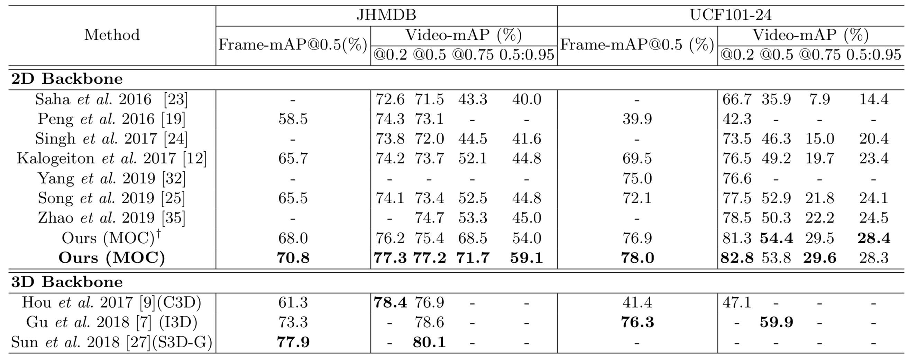

# Evaluation

## Results and Models

Our experimental results are:



<br/>

#### UCF101-24

|             Model              | Pretrain model | FrameAP@0.5 | VideoAP@0.2 \| @0.5 \| @0.75 \| 0.5:0.95 |                           Download                           |
| :----------------------------: | :------------: | :---------: | :--------------------------------------: | :----------------------------------------------------------: |
|   ucf_dla34_K7_rgb_coco.pth    |      COCO      |    73.14    |     78.81 \| 51.02 \| 27.05 \| 26.51     | [model](https://drive.google.com/file/d/1wQQC4btMxdOp5vAx9DxP3u2z-RejeLPm/view?usp=sharing) |
|   ucf_dla34_K7_flow_coco.pth   |      COCO      |    68.06    |     76.59 \| 46.57 \| 18.96 \| 21.35     | [model](https://drive.google.com/file/d/17uhzvKwMgGbgbu0eR5t7M7Q90VszWo0d/view?usp=sharing) |
|       K7 RGB + FLOW COCO       |      COCO      |    78.01    |     82.81 \| 53.83 \| 29.59 \| 28.33     |                                                              |
|                                |                |             |                                          |                                                              |
| ucf_dla34_K7_rgb_imagenet.pth  |    ImageNet    |    70.69    |     75.37 \| 50.47 \| 25.61 \| 25.96     | [model](https://drive.google.com/file/d/1n7thrWHtjRfqI6YyxB44F99aioEcSCfr/view?usp=sharing) |
| ucf_dla34_K7_flow_imagenet.pth |    ImageNet    |    68.90    |     77.30 \| 47.94 \| 19.41 \| 21.98     | [model](https://drive.google.com/file/d/1QHImtoMltmeIQOYWFYqkmJ0qZEfVpUe2/view?usp=sharing) |
|     K7 RGB + FLOW ImageNet     |    ImageNet    |    76.92    |     81.26 \| 54.43 \| 29.49 \| 28.42     |                                                              |

<br/>

#### JHMDB

|                 Model                  | Pretrain model | FrameAP@0.5 | VideoAP@0.2 \| @0.5 \| @0.75 \| 0.5:0.95 |                           Download                           |
| :------------------------------------: | :------------: | :---------: | :--------------------------------------: | :----------------------------------------------------------: |
|     hmdb_s1_dla34_K7_rgb_coco.pth      |      COCO      |      -      |                    -                     | [model](https://drive.google.com/file/d/18zxHPFTw_2KAmUcwsX-AB7FRsbFBZJCk/view?usp=sharing) |
|     hmdb_s1_dla34_K7_flow_coco.pth     |      COCO      |      -      |                    -                     | [model](https://drive.google.com/file/d/17TYE2mKeQiENF3z3IPLTxWOHLOy4TFnr/view?usp=sharing) |
|     hmdb_s2_dla34_K7_rgb_coco.pth      |      COCO      |      -      |                    -                     | [model](https://drive.google.com/file/d/1G810YYoQVp9qdOleR7QyLPddO8TxQeE5/view?usp=sharing) |
|     hmdb_s2_dla34_K7_flow_coco.pth     |      COCO      |      -      |                    -                     | [model](https://drive.google.com/file/d/1aRK_HbOtRIiZToBUvbFYVyAHQEyTnMl6/view?usp=sharing) |
|     hmdb_s3_dla34_K7_rgb_coco.pth      |      COCO      |      -      |                    -                     | [model](https://drive.google.com/file/d/1u3ktmzEd_VW2314AvVi85Lhy6H9d0Ju_/view?usp=sharing) |
|     hmdb_s3_dla34_K7_flow_coco.pth     |      COCO      |      -      |                    -                     | [model](https://drive.google.com/file/d/1GZp8H7bUJxEfEONzPeQ5w2AkQBNLoSDx/view?usp=sharing) |
|   K7 RGB + FLOW COCO 3 split average   |      COCO      |    70.79    |     77.33 \| 77.19 \| 71.69 \| 59.08     |                                                              |
|                                        |                |             |                                          |                                                              |
|   hmdb_s1_dla34_K7_rgb_imagenet.pth    |    ImageNet    |      -      |                    -                     | [model](https://drive.google.com/file/d/1aoRI4lglsxJO5g2Rs7cNd1lrsjGLMxPR/view?usp=sharing) |
|   hmdb_s1_dla34_K7_flow_imagenet.pth   |    ImageNet    |      -      |                    -                     | [model](https://drive.google.com/file/d/1vYUH612JRo9gOFE52BTjMnD5289VSpUi/view?usp=sharing) |
|   hmdb_s2_dla34_K7_rgb_imagenet.pth    |    ImageNet    |      -      |                    -                     | [model](https://drive.google.com/file/d/1HT20nEG3hYmJ2Cr37muBa45x8IpO-N0U/view?usp=sharing) |
|   hmdb_s2_dla34_K7_flow_imagenet.pth   |    ImageNet    |      -      |                    -                     | [model](https://drive.google.com/file/d/1eqgW_JcYwTIwaqL4phthG7bC99i7hZjq/view?usp=sharing) |
|   hmdb_s2_dla34_K7_rgb_imagenet.pth    |    ImageNet    |      -      |                    -                     | [model](https://drive.google.com/file/d/15nvmbt19709MD37QZtaSnvL_2WlMfEoa/view?usp=sharing) |
|   hmdb_s3_dla34_K7_flow_imagenet.pth   |    ImageNet    |     --      |                                          | [model](https://drive.google.com/file/d/1rDoE356pttM3NUxBHc9dr-FHQ8c66DR8/view?usp=sharing) |
| K7 RGB + FLOW ImageNet 3 split average |    ImageNet    |    67.95    |     76.23 \| 75.41 \| 68.46 \| 53.98     |                                                              |
|                                        |                |             |                                          |                                                              |

All these models are available at our [Google drive](https://drive.google.com/drive/folders/1rQd79JjcQAfMxOJwXoCdh05ryOb-P1dm?usp=sharing)

Copy models to ${MOC_ROOT}/experiment/result_model

<br/>

## Inference Step

Firstly, we will get detection results using previous models.

please run

~~~bash
python3 det.py --task normal --K 7 --gpus 0,1,2,3,4,5,6,7 --batch_size 94 --master_batch 10 --num_workers 8 --rgb_model ../experiment/result_model/$PATH_TO_RGB_MODEL --flow_model ../experiment/result_model/$PATH_TO_FLOW_MODEL --inference_dir $INFERENCE_DIR --flip_test --ninput 5

# handle remained chunk size
python3 det.py --task normal --K 7 --gpus 0 --batch_size 1 --master_batch 1 --num_workers 2 --rgb_model ../experiment/result_model/dla34_K7_rgb_coco.pth --flow_model ../experiment/result_model/dla34_K7_flow_coco.pth --inference_dir /data0/liyixuan/speed_test/test --flip_test --ninput 5

# --task           during inference, there are three optional method: "normal", "stream", "speed", use "normal" by default
# --K              input tubelet length, 7 by default
# --gpus           gpu list, in our experiments, we use 8 NVIDIA TITAN XP
# --batch_size     total batch size 
# --master_batch   batch size in the first gpu
# --num_workers    total workers
# --rgb_model      path to rgb model
# --flow_model     path to flow model
# --inference_dir  path to save inference results, will be used in mAP step
# --flip_test      flip test during inference, will slightly improve performance but slow down the inference speed
# --ninput 5       stack frames, 1 for rgb, 5 for optical flow 

# additional scripts for jhmdb
# --dataset hmdb
# --split 1        there are 3 splits
# --hm_fusion_rgb  0.4 for jhmdb, 0.5 for ucf, 0.5 by default

~~~

`$PATH_TO_RGB_MODEL` is downloading rgb model.

`$PATH_TO_FLOW_MODEL` is downloading flow model.

`$INFERENCE_DIR` is path to save inference results.

More details for `flip_test` can be found in [Tips.md](Tips.md) #1.

<br/>

If you want to run on JHMDB dataset, please add `--dataset hmdb --split 1 --hm_fusion_rgb` for split 1.

After inference, you will get detection results in `$INFERENCE_DIR`.

<br/>

## Evaluate mAP

We use the evaluation code from [ACT](https://github.com/vkalogeiton/caffe/tree/act-detector). 

The evalution time will depend on CPU. 

<br/>

1. For frame mAP, please run:

```python
python3 ACT.py --task frameAP --K 7 --th 0.5 --inference_dir $INFERENCE_DIR
```

Choose a small `--N` when inference will speed up this step. More details an be found in [Tips.md](Tips.md) #2.

<br/>

2. For video mAP, please build tubes first:

```python
python3 ACT.py --task BuildTubes --K 7 --inference_dir $INFERENCE_DIR
```

Then, compute video mAP:

```python
# change --th
python3 ACT.py --task videoAP --K 7 --th 0.2 --inference_dir $INFERENCE_DIR

# 0.5:0.95
python3 ACT.py --task videoAP_all --K 7 --inference_dir $INFERENCE_DIR 
```

<br/>

3. [Optional] More scripts

```bash
# for jhmdb dataset, please add       '--dataset hmdb --split 1'   for split 1
# add '--exp_id XXX'  the mAP results will be saved in XXX
# add '--model_name YYY'  it can distinguish different models in XXX
# for safety, tube results will be saved in $INFERENCE_DIR, add '--redo' to ignore previous tube results
```

<br/>

<br/>

## Online Spatio-Temporal Action Detection

MOC can be also applied for the real-time video stream after some engineering modifications. For video stream, MOC will use only previous K-1 frames and current frame. 

Since the backbone feature can be extracted only once, we save previous K-1 frames' features in a buffer. When getting a new frame, MOC's backbone first extracts its feature and combines with the previous K-1 frames' features in buffer. Then, the K frames' features are fed into MOC's three branches to generate tubelet detections. Finally, the linking algorithm builds video-level detection results with these new tubelets at once. After that, update the buffer with current frame's feature for subsequent video stream's detection.

<br/>

Now we provide a new inference method called 'stream_inference', which can handle real-time video stream online.

Each backbone feature will compute only once and save in a buffer, which avoids redundant computation.

please run:

```python
python3 det.py --task stream --K 7 --gpus 0 --batch_size 1 --master_batch 1 --num_workers 0 --rgb_model ../experiment/result_model/$PATH_TO_RGB_MODEL --inference_dir $INFERENCE_DIR --dataset hmdb --split 1
```

We use JHMDB because its valuation set is small.

You may notice some lags during stream_inference, please see this: [Tips.md](Tips.md) #3.

<br/>

It can be modified for real-time video stream.

We will try to finish it as soon as possible, then MOC will use only previous K-1 frames and current frame. 

<br/>

## Bash File

We also provide bash file for evaluation. Please refer [ucf_normal_inference.sh](../bash/ucf_normal_inference.sh) and [jhmdb_stream_inference.sh](../bash/jhmdb_stream_inference.sh).

