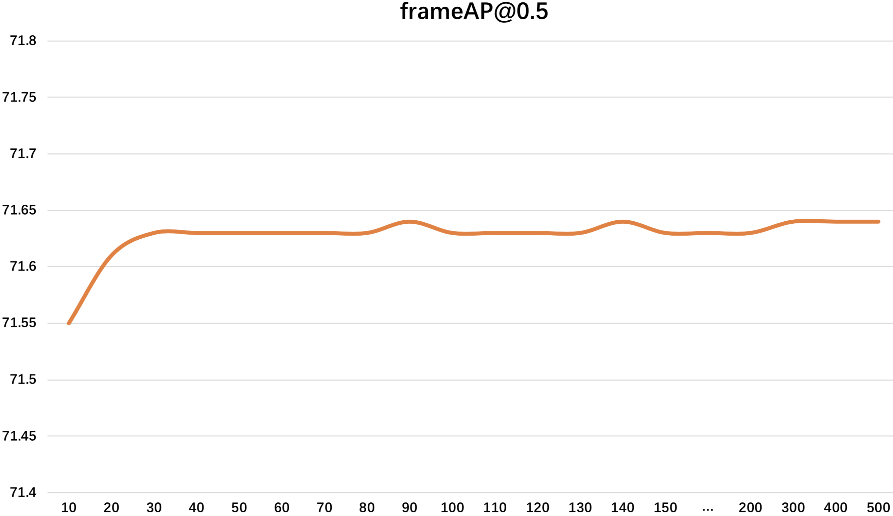

# Tips

#### 1. About flip_test

During inference, we use flip test to improve backbone feature discrimination follow CenterNet.

 After submission we found the improvment is not notable but badly slow down the inference speed (about x1.8 times).

| Results on UCF (K7 RGB + FLOW COCO) | FrameAP@0.5 | VideoAP@0.2 \| @0.5 \| @0.75 \| 0.5:0.95 |
| :---------------------------------: | :---------: | :--------------------------------------: |
|              with flip              |    78.01    |     82.81 \| 53.83 \| 29.59 \| 28.33     |
|            without flip             |    77.46    |     82.40 \| 54.21 \| 29.38 \| 28.24     |

So this is a trad-off between speed and accuracy. If you don't care about ~0.5 precision, please abandon `--flip_test` for faster inference speed.

 

#### 2. About N

  

This ablation study shows that increasing N will not improve the performance. For consistency we choose N=100 in our paper, but N >= 30 is enough.

You can use a small N for faster 'Tubelet Linking'.

The results use K=5 and only rgb as input on UCF. 

More detials can be found in our **Supplementary Material**.

 

#### 3. Lags in stream_inference

During inference, you may notice some lags. This is caused by changing a new video because there are plenty of video clips in validation set.

Old video's feature is not continuity for new video, so the feature buffer will be cleaned up which leads to a lag.

**So the inference speed is much lower than the theoretical speed.**

 

#### 4. Use `--N 10` and abandon `--flip_test` during inference

| Results on UCF (K7 RGB + FLOW COCO) | FrameAP@0.5 | VideoAP@0.2 \| @0.5 \| @0.75 \| 0.5:0.95 |
| :---------------------------------: | :---------: | :--------------------------------------: |
|         N=100    with flip          |    78.01    |     82.81 \| 53.83 \| 29.59 \| 28.33     |
|         N=10   without flip         |    77.43    |     83.08 \| 53.89 \| 29.49 \| 28.22     |

| Results on UCF (K7 RGB) | FrameAP@0.5 | VideoAP@0.2 \| @0.5 \| @0.75 \| 0.5:0.95 |
| :---------------------: | :---------: | :--------------------------------------: |
|   N=100    with flip    |    73.14    |     78.81 \| 51.02 \| 27.05 \| 26.51     |
|   N=10   without flip   |    72.05    |     78.23 \| 50.77 \| 26.10 \| 26.16     |

The new results are acceptable on UCF dataset. (The performance gap is 0.5-1.5)

Moreover the boosting on inference speed is remarkable. (about **x1.8** for inference step and **x5.5** for build step)