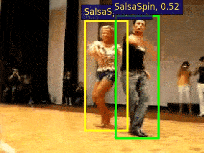
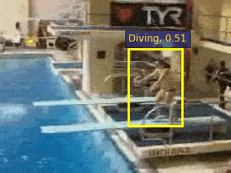
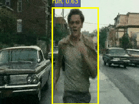
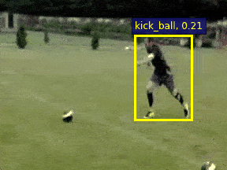
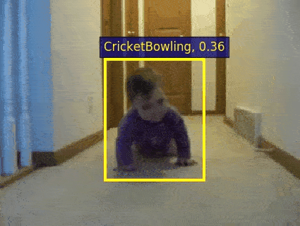

# Visualization

We provide codes for visualization the detection results. (These gifs are produced by two-stream models with brox-flow pre-extracted)
<div align="center" style="width:image width px;">
  
  
  
</div>
<div align="center" style="width:image width px;">
  
  
  
</div>


The visualization codes are located in [${MOC_ROOT}/src/vis](../src/vis). For convenience, we separate a part of codes from `opts.py` and `datasets/dataset` to make a simple instantiation.

<br/>

Firstly, download the ucf24 test videos from our [Google drive](https://drive.google.com/drive/folders/1BvGywlAGrACEqRyfYbz3wzlVV3cDFkct?usp=sharing).

```powershell
tar -zxvf ucf_test_videos.tar.gz
```

<br/>

Create a soft link:

```powershell
ln -s $PATH_TO_DOWNLOAD/ucf_test_videos   ${MOC_ROOT}/data/ucf_test_videos
```

Now we only support visualization for ucf24 test set (same for training set but meaningless).

<br/>

Then download our pretrained [model](https://drive.google.com/file/d/1wQQC4btMxdOp5vAx9DxP3u2z-RejeLPm/view?usp=sharing) on ucf24  (we only provide rgb model because online optical flow extraction is not supported yet).

```powershell
mv $PATH_TO_DOWNLOAD/ucf_dla34_K7_rgb_coco.pth   ${MOC_ROOT}/experiment/result_model/
```

<br/>

You can choose a `.mp4` video from ucf24 [test_video_list](../src/vis/test_video_list.txt)). Video frames will be extracted automatically and MOC-Detector will manipulate these frames to produce spatialtemporal detection results (saved in `.pkl` file). After linking algorithm the result tubelet will be added on each frame. Finally you will get a `.avi` visualization video in  `INFERENCE_DIR`.

(.mp4 --> .jpg --> .pkl --> .jpg --> .avi)

<br/>

For short, run this script in `${MOC_ROOT}/src/vis`

```python
python3 vis_det.py --vname v_SalsaSpin_g03_c06.mp4
```

(`--vname` choose a video in ucf24 [test_video_list](../src/vis/test_video_list.txt))

<br/>

You should modify these args in [tiny_opt.py](../src/vis/tiny_opt.py):

```python
# important args:
#
# --DATA_ROOT        path to ucf24 test videos, by default is ${MOC_ROOT}/data/ucf_test_videos
# --inference_dir    path to generate result video, by default is ${MOC_ROOT}/src/vis/result_video
# --rgb_model        path to ucf24 rgb model, by default is ${MOC_ROOT}/experiment/result_model/ucf_dla34_K7_rgb_coco.pth
```

<br/>

You can modify these two thresholds to control visualization performance:
```python
# visualization threshold:
#
# --tube_vis_th      the lowest score for retaining a tubelet, by default is 0.12 (tubelet score)
# --frame_vis_th     the lowest score for retaining a individual frame in the tubelet, by default is 0.015 (frame score)
```

Do not set a ver large `--tube_vis_th` due to the property of the focal loss, otherwise it will eliminate most of detection tubelets.

`--frame_vis_th` will eliminate the lower score detection frames from a tubelet. On the one hand it can handle the action boundary but on the other hand, it may lead to the **discontinuity**.

So it depends on specific situations. 

<div align="center" style="width:image width px;">
  
</div>


&emsp;&emsp;&emsp;&emsp;&emsp;&emsp;&emsp;&emsp;&emsp;&emsp;&emsp;&emsp;&emsp;&emsp;&emsp;(Left `--frame_vis_th` is 0.015 &emsp;&emsp;&emsp;&emsp;Right `--frame_vis_th` is 0.2)

<br/>

If you select a video **excluding** UCF 24 action classes, the actor bbox may be detected but the action label will be mis-classified. (Unseen classes in training set)

<div align="center" style="width:image width px;">
  
  
</div>


 `BabyCrawling`  and `BoxingPunchingBag` are in ucf101 but not in ucf24 sub-class, so they are both mis-classified. Fortunately, actor bbox detection still work well.

<br/>

Instance level boxes reflect video mAP. We show different instances as different colored boxes. The detection results may not be satisfied because video mAP is much lower than frame mAP on UCF (78.0 for frameAP@0.5 and 53.8 for videoAP@0.5).

You can use `--instance_level` to draw these colored boxes.

<div align="center" style="width:image width px;">
  
  
</div>

You may wonder why a man in the right gif changes its bbox color. That means one continuous action is broken into two instances by MOC because of occlusion.

<br/>

Now online brox-flow extraction is not supported. So we provide an alternative method using pre-extracted brox-flow to generate two-stream detection results. Make sure you download the ucf24 dataset at `${MOC_ROOT}/data/ucf24`.

<div align="center" style="width:image width px;">
  
  
</div>

The left part is rgb model detection result.  The right part is two-stream detection result. (`--tube_vis_th 0.05`)

You can add `--flow_model ../../experiment/result_model/ucf_dla34_K7_flow_coco.pth` to get two-stream visualization result.

Most of our visualization results are produced by two-stream MOC.

